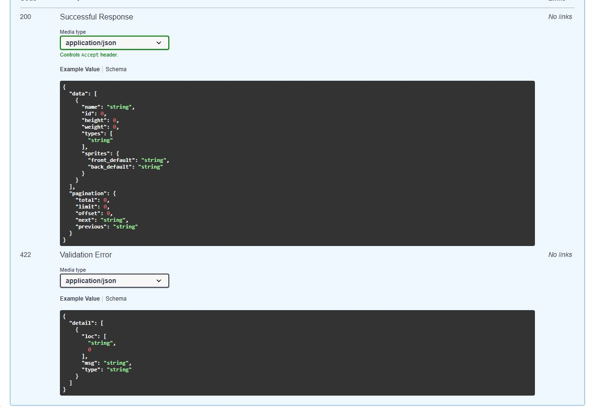
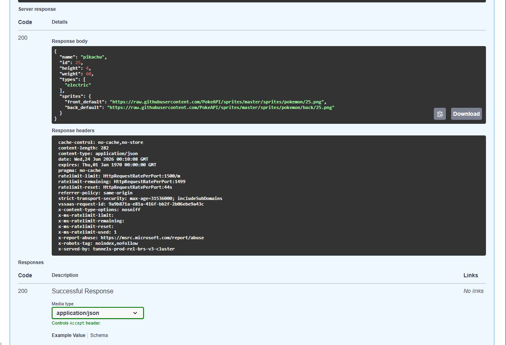
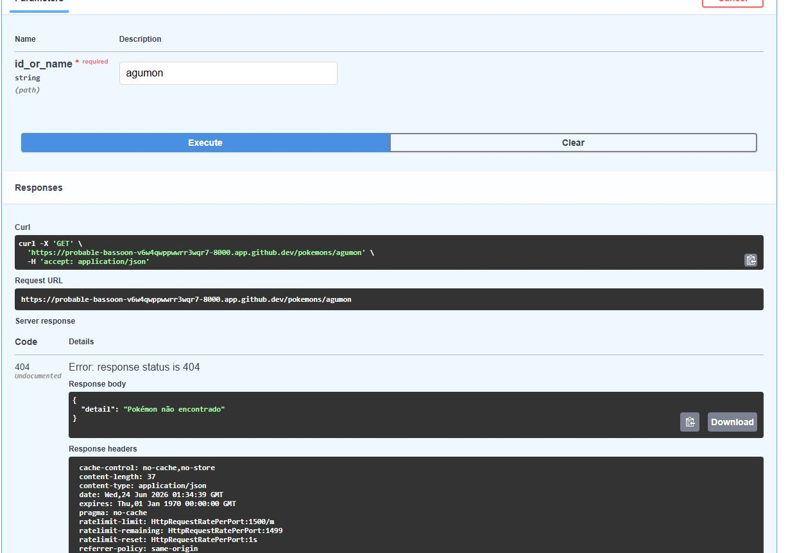
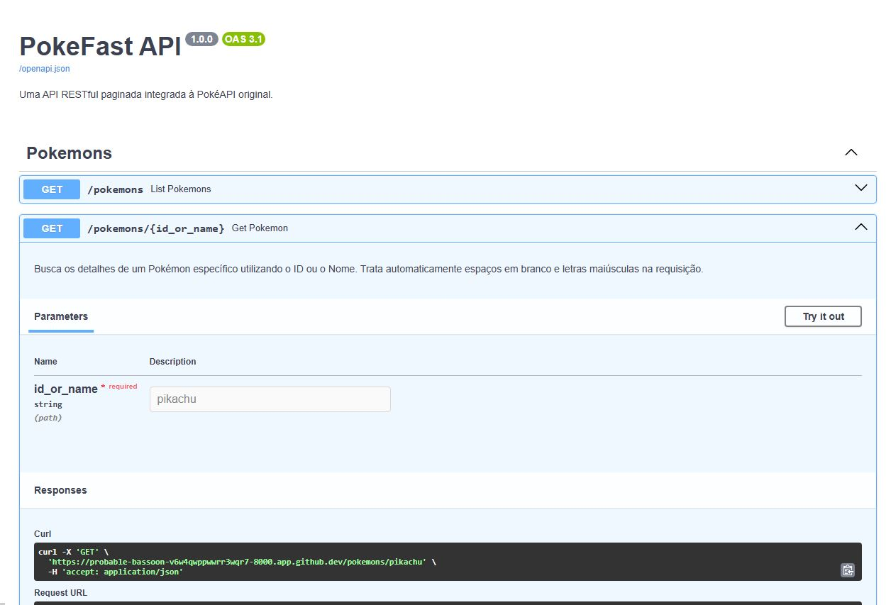
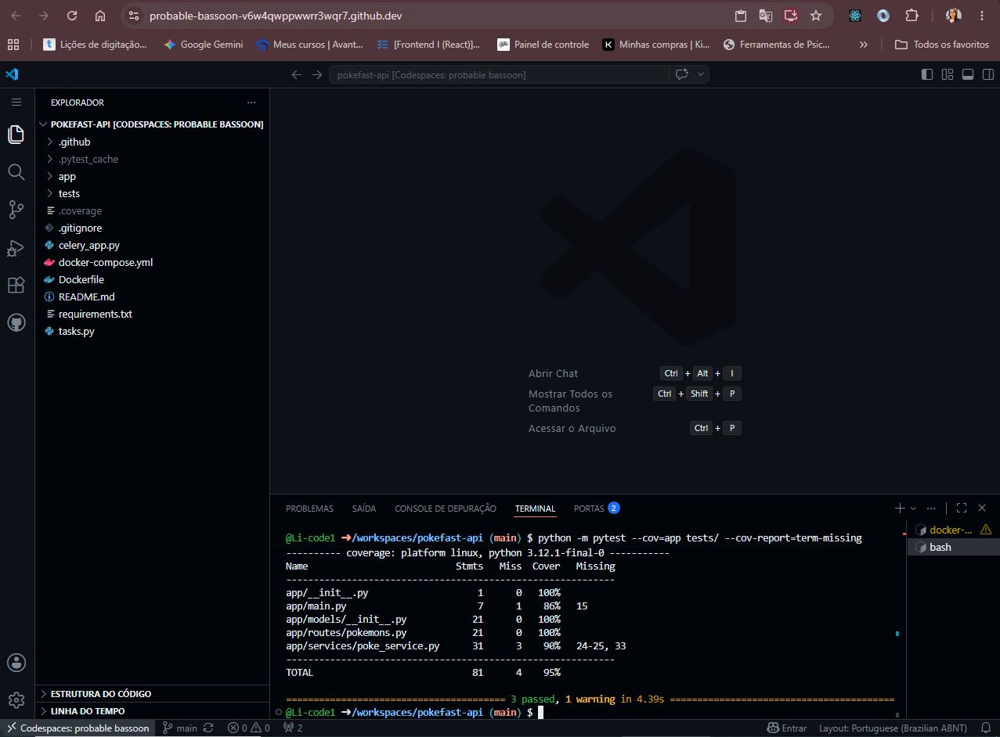
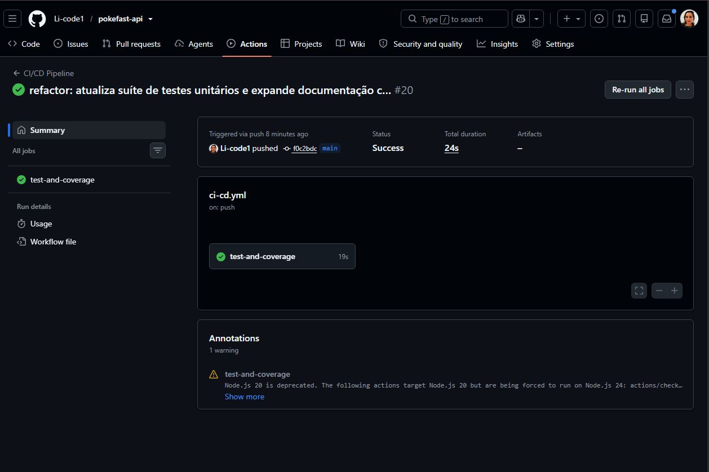

# 🚀 PokeFast API

## 🔗 Links do Projeto em Produção (Deploy)

O projeto foi publicado com sucesso e está disponível publicamente nos seguintes links:

* **API Online (Render):** [https://pokefast-api-ebac.onrender.com](https://pokefast-api-ebac.onrender.com)
* **Documentação Interativa (Swagger UI):** [https://pokefast-api-ebac.onrender.com/docs](https://pokefast-api-ebac.onrender.com/docs)

Uma API RESTful assíncrona, robusta e paginada construída em Python com **FastAPI**. O projeto consome dados reais da [PokéAPI](https://pokeapi.co/) original e expõe endpoints padronizados, contando com testes unitários automatizados, cobertura de código, containerização em Docker e pipeline de CI/CD via GitHub Actions.

---

## 📋 Funcionalidades e Requisitos Atendidos

- **FastAPI & Python 3.10+**: Desenvolvimento utilizando tipagem estrita (*type hints*) em todas as funções.
- **Consumo de Dados Paginado**: Integração assíncrona com os endpoints da PokéAPI usando `httpx`.
- **Endpoints Completos**: 
  - `GET /pokemons`: Listagem estruturada com paginação inteligente via parâmetros `limit` e `offset`.
  - `GET /pokemons/{id_or_name}`: Busca detalhada de um Pokémon específico por ID ou Nome.
- **Testes Unitários**: Cobertura das rotas de sucesso, paginação e tratamento de erro (404 Not Found) usando `pytest` e `pytest-cov`.
- **Dockerização**: Arquivo `Dockerfile` otimizado para produção.
- **CI/CD Pipeline**: Automação de testes e checagem de cobertura integrada ao GitHub Actions a cada push na branch principal.

---

## ⚙️ Estrutura Modular do Projeto

```text
pokefast-api/
│
├── .github/
│   └── workflows/
│       └── ci-cd.yml           # Configuração da esteira de CI/CD (GitHub Actions)
│
├── app/
│   ├── main.py                 # Inicializador e configuração da API FastAPI
│   ├── __init__.py             # Inicializador do pacote app
│   │
│   ├── models/
│   │   └── __init__.py         # Esquemas de validação e tipagem Pydantic
│   │
│   ├── routes/
│   │   └── pokemons.py         # Endpoints e controle de paginação
│   │
│   ├── services/
│   │   └── poke_service.py     # Comunicação assíncrona com a PokéAPI externa
│   │
│   └── utils/
│       └── formatters.py       # Funções auxiliares de formatação de strings
│
├── tests/
│   └── test_pokemons.py        # Suíte de testes unitários com pytest
│
├── .env                        # Variáveis de ambiente locais
├── .gitignore                  # Arquivos ignorados pelo Git
├── celery_app.py               # Configuração da instância e broker do Celery
├── docker-compose.yml          # Orquestração dos containers (API e Redis)
├── Dockerfile                  # Instruções de montagem da imagem Docker
├── requirements.txt            # Dependências estruturadas do projeto
└── tasks.py                    # Definição das tarefas em background e cache

```

---

## 🔧 Como Rodar Localmente

### Pré-requisitos

* Python 3.10 ou superior instalado.

### Passo a Passo

1. **Clone o repositório:**
```bash
git clone [https://github.com/Li-code1/pokefast-api.git](https://github.com/seu-usuario/pokefast-api.git)
cd pokefast-api

```


2. **Crie e ative um ambiente virtual:**
```bash
python -m venv .venv
# No Windows (Prompt de Comando):
.venv\Scripts\activate
# No Linux/macOS:
source .venv/bin/activate

```


3. **Instale as dependências:**
```bash
pip install -r requirements.txt

```


4. **Configure o arquivo `.env`:**
Crie um arquivo chamado `.env` na raiz do projeto com o seguinte conteúdo:
```env
POKEAPI_URL=[https://pokeapi.co/api/v2/pokemon/](https://pokeapi.co/api/v2/pokemon/)

```


5. **Inicie o servidor de desenvolvimento:**
```bash
uvicorn app.main:app --reload

```


A API estará disponível em: `http://127.0.0.1:8000`

---

## 🧪 Como Executar os Testes e Cobertura

Para rodar a suíte de testes unitários e verificar a cobertura do código (gerando o relatório solicitado), execute:

```bash
pytest --cov=app tests/ --cov-report=term-missing

```

---

## 🐳 Executando com Docker

Se preferir rodar a aplicação isolada em um container:

1. **Construa a imagem Docker:**
```bash
docker build -t pokefast-api .

```


2. **Execute o container passando as variáveis de ambiente:**
```bash
docker run -d -p 8000:8000 --env-file .env --name pokefast-app pokefast-api

```


---

## 📖 Documentação da API (Swagger UI)

O FastAPI gera a documentação automaticamente. Com a API rodando, acesse:

* **Swagger UI (Interativo)**: `http://127.0.0.1:8000/docs`

---

## 📌 Exemplos de Requisição e Resposta

### 1. Listagem de Pokémons Paginada

**Requisição:**
`GET /pokemons?limit=2&offset=0`

**Resposta (JSON):**

```json
{
  "data": [
    {
      "name": "bulbasaur",
      "id": 1,
      "height": 7,
      "weight": 69,
      "types": ["grass", "poison"],
      "sprites": {
        "front_default": "[https://raw.githubusercontent.com/PokeAPI/sprites/master/sprites/pokemon/1.png](https://raw.githubusercontent.com/PokeAPI/sprites/master/sprites/pokemon/1.png)",
        "back_default": "[https://raw.githubusercontent.com/PokeAPI/sprites/master/sprites/pokemon/back/1.png](https://raw.githubusercontent.com/PokeAPI/sprites/master/sprites/pokemon/back/1.png)"
      }
    },
    {
      "name": "ivysaur",
      "id": 2,
      "height": 10,
      "weight": 130,
      "types": ["grass", "poison"],
      "sprites": {
        "front_default": "[https://raw.githubusercontent.com/PokeAPI/sprites/master/sprites/pokemon/2.png](https://raw.githubusercontent.com/PokeAPI/sprites/master/sprites/pokemon/2.png)",
        "back_default": "[https://raw.githubusercontent.com/PokeAPI/sprites/master/sprites/pokemon/back/2.png](https://raw.githubusercontent.com/PokeAPI/sprites/master/sprites/pokemon/back/2.png)"
      }
    }
  ],
  "pagination": {
    "total": 1302,
    "limit": 2,
    "offset": 0,
    "next": "[http://127.0.0.1:8000/pokemons?limit=2&offset=2](http://127.0.0.1:8000/pokemons?limit=2&offset=2)",
    "previous": null
  }
}

```

### 2. Detalhes de um Pokémon Específico

**Requisição:**
`GET /pokemons/pikachu` ou `GET /pokemons/25`

**Resposta (JSON):**

```json
{
  "name": "pikachu",
  "id": 25,
  "height": 4,
  "weight": 60,
  "types": ["electric"],
  "sprites": {
    "front_default": "[https://raw.githubusercontent.com/PokeAPI/sprites/master/sprites/pokemon/25.png](https://raw.githubusercontent.com/PokeAPI/sprites/master/sprites/pokemon/25.png)",
    "back_default": "[https://raw.githubusercontent.com/PokeAPI/sprites/master/sprites/pokemon/back/25.png](https://raw.githubusercontent.com/PokeAPI/sprites/master/sprites/pokemon/back/25.png)"
  }
}

```

---

## 🚀 Links de Produção

* **Link da API em Produção**: `https://pokefast-api-ebac.onrender.com` 

```

```
## 📸 Demonstração da API e Evidências de Testes

Para comprovação dos critérios técnicos exigidos, seguem os registros visuais das respostas estruturadas da API, testes locais e integração contínua:

### 1. Listagem Geral Paginada (`GET /pokemons`)
Endpoint responsável por listar os Pokémons consumidos de forma assíncrona da PokéAPI, contendo a paginação estruturada dinamicamente com os campos `total`, `limit`, `offset`, `next` e `previous`:


### 2. Busca por ID ou Nome (`GET /pokemons/{id_or_name}`)
Endpoint de busca detalhada aplicando o tratamento de strings nativo (.strip().lower()). O retorno traz exatamente os campos mapeados (`id`, `name`, `height`, `weight`, `types` e o objeto estruturado de `sprites`):


### 2. Busca por ID ou Nome (`GET /pokemons/{id_or_name}`)

#### A) Retorno com Sucesso (Status 200)
Exemplo de requisição retornando os detalhes filtrados e tratados de um Pokémon existente:


#### B) Tratamento de Erro - Pokémon Não Encontrado (Status 404)
Demonstração de resiliência da API ao lidar com parâmetros inválidos, retornando o status HTTP correto e uma mensagem clara para o usuário:


### 3. Documentação Automatizada e Interativa (Swagger UI)
Visão geral da estrutura gerada automaticamente pelo FastAPI mapeando e documentando de forma clara as rotas construídas:


### 4. Cobertura de Testes Automatizados (Pytest-Cov)
Execução da suíte de testes unitários localmente através do ambiente do Codespaces, atingindo com sucesso **95% de cobertura total** do código da aplicação:


### 5. Integração Contínua (GitHub Actions Pipeline)
Esteira de CI/CD configurada via GitHub Actions executando com sucesso e sem falhas todas as validações estruturais e testes automáticos a cada commit realizado:
